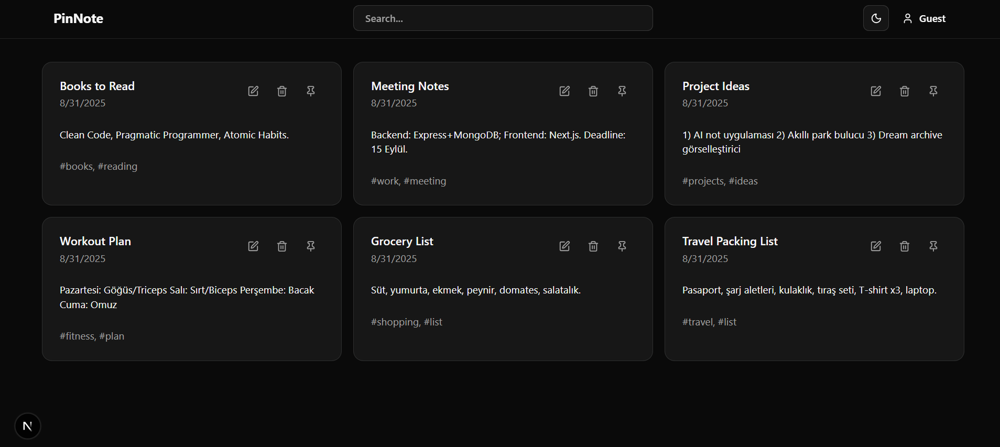

# PinNote App

A modern FUll Stack note-taking application with secure authentication and clean UI.

## Screenshots




## Tech Stack

**Backend**: Node.js, Express.js, MongoDB, JWT, Arcjet  
**Frontend**: Next.js, TypeScript, Tailwind CSS, shadcn/ui

## Quick Start

1. **Clone & Install**
```bash
git clone https://github.com/your-username/pinnote-app.git
cd pinnote-app

# Backend
cd Backend && npm install

# Frontend  
cd Frontend && npm install
```

2. **Environment Setup**  
Create `.env` in Backend folder:
```env
PORT=5000
MONGODB_URI=mongodb://localhost:27017/pinnote
JWT_SECRET=your-jwt-secret
ARCJET_KEY=your-arcjet-key
```

3. **Run Application**
```bash
# Backend
cd Backend && npm run dev

# Frontend
cd Frontend && npm run dev
```

Visit `http://localhost:3000`

## Features

- User authentication & authorization
- Create, edit, delete notes
- Responsive design with dark/light mode
- API security with rate limiting
